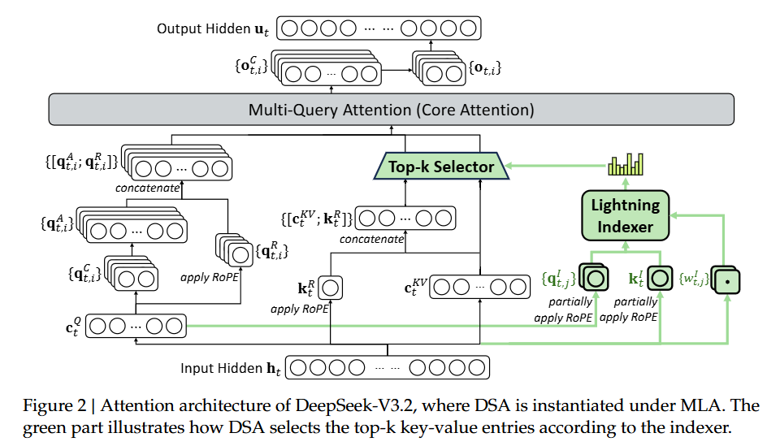
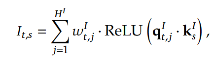
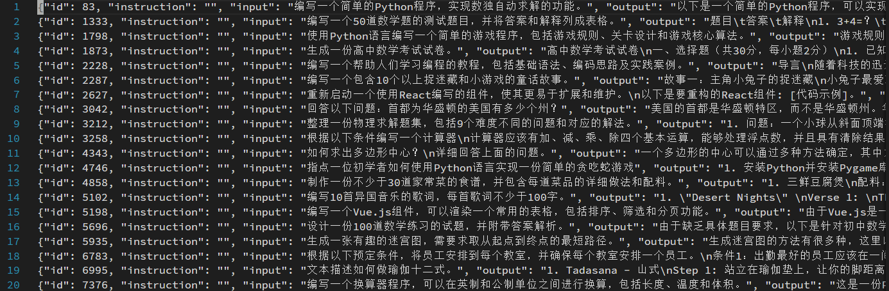
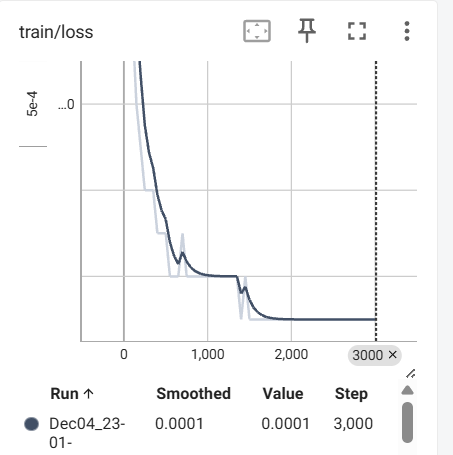
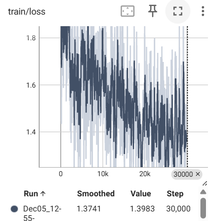

# dsa_reproduce DeepSeek Sparse Attention (DSA) 复现

本项目基于 Qwen2.5-0.5B 语言模型复现 DSA，模型层面修改 + 训练 + 评估。

## 🎯 项目概述
复现 DSA（DeepSeek Sparse Attention）：以 Qwen2.5-0.5B 为基座，使用 deepctrl-sft-data 数据集微调，对比引入 DSA 结构后的效果。

## 🔍 算法原理

DSA 的原理需要从模型和训练两个层面进行说明。

### 模型层面
参考 DeepSeek 技术报告中的示意图，DSA 包括轻量打分器（lightning indexer）和 top-k 选择器（top-k selector）两部分。

DSA 的整体流程是先用 lightning indexer 对 token 进行一次打分，仅选择重要性得分 top-k 的 token 进行 attention 计算，这样就实现了注意力计算的稀疏 Sparse。

e.g. 输入模型的上下文长度为 128K，仅选择 top-2048 的 token 进行 attention 计算，实现了推理时的极致效率，推理成本从 128K token -> 2048 token。
<p align="center">
    
</p>

设计上 DSA 属于一个网络结构，线性映射函数 w 加上激活函数 ReLU。
<p align="center">
    
</p>

下面是模型结构上的代码实现
```python
class Indexer(nn.Module):
    def __init__(self, config):
        super().__init__()
        self.hidden_size: int = config.hidden_size
        self.n_heads: int = config.num_attention_heads
        self.key_value_heads = config.num_key_value_heads
        self.head_dim: int = config.hidden_size // config.num_attention_heads
        self.index_topk: int = 128

        self.wk = nn.Linear(self.hidden_size, self.head_dim) 
        self.weights_proj = nn.Linear(self.hidden_size, self.n_heads)

        self.register_buffer("k_cache", None, persistent=False)

    def forward(self, hidden_states: torch.Tensor, query_states: torch.Tensor, cos: torch.Tensor, sin: torch.Tensor, mask=None):
        bsz, seqlen, _ = hidden_states.size()
        key_states = self.wk(hidden_states)

        weights = self.weights_proj(hidden_states) * self.n_heads ** -0.5 # [bs, seqlen, n_heads]

        # q:[bs, n_heads, seqlen, head_dim]
        # k:[bs, seqlen, head_dim]

        if seqlen > 1:
            self.k_cache = key_states

        if seqlen == 1:
            key_states = torch.cat([self.k_cache, key_states], dim=1) # [bs, seqlen, head_dim]
            self.k_cache = key_states

        key_states = key_states.unsqueeze(1) # [bs, 1, seqlen, head_dim]
        key_states, key_states = apply_rotary_pos_emb(key_states, key_states, cos, sin)

        # [bs, n_heads, seqlen, head_dim] * [bs, 1, head_dim, seqlen] --> [bs, n_heads, seqlen, seqlen]
        attn_scores = query_states @ key_states.transpose(2,3)
        attn_scores = F.relu(attn_scores, inplace=False)

        # [bs, n_heads, seqlen, 1] * [bs, n_heads, seqlen, seqlen] --> [bs, n_heads, seqlen, seqlen]
        attn_scores = weights.transpose(1,2).unsqueeze(-1) * attn_scores

        attn_scores = attn_scores.sum(1, keepdim=True) # [bs, 1, seqlen, seqlen]

        if mask is not None:
            attn_scores = attn_scores + mask

        topk_indices = attn_scores.topk(min(self.index_topk, key_states.shape[2]), dim=-1)[1]
        return topk_indices, attn_scores
```

### 训练层面
训练层面上 DeepSeek 采用了的阶段训练方式，一阶段 warmup + 二阶段联合训练。官方技术报告中对这部分训练描述较为模糊，下面结合G老师的分析详细讲解一下。

1. warmup 阶段：训练打分器，让 indexer 能够区分 token 的重要性

冻结基模参数，仅训练打分器，采样蒸馏的思路。dense attention 为 teacher，indexer 为 student。dense attention 输出的多头注意力相加，再用 L1 归一化得到 token 的重要性分布，用 KL 散度约束 indexer 去逼近这个重要性分布。这一步中 indexer 算出来的具体数值是多少不重要，能区分大小关系即可。而且由于 indexer 参数量很少，这个步骤的计算消耗远小于 dense attention。

下面是 warmup 训练的代码实现
```python
# warmup 训练损失函数
def compute_loss(self, model, inputs, return_outputs=False, num_items_in_batch=None):
    outputs = model(**inputs, output_attentions=True)
    all_attentions = outputs.attentions
    ce_loss = outputs.loss

    attention_kl_loss = torch.tensor(0.0, device=outputs.loss.device)

    for attention in all_attentions:
        topk_indices, raw_attn_weights, indexer_attn_scores = attention

        raw_attn_weights_topk = torch.gather(raw_attn_weights, -1, topk_indices.expand(-1, raw_attn_weights.shape[1], -1, -1))

        raw_attn_weights_topk = F.softmax(raw_attn_weights_topk, dim=-1)

        # head维度求和
        raw_attn_weights_topk = raw_attn_weights_topk.sum(1, keepdim=True)

        # L1归一化
        raw_attn_weights_topk = raw_attn_weights_topk / torch.norm(raw_attn_weights_topk, dim=-1, p=1, keepdim=True)

        indexer_attn_scores_topk = torch.gather(indexer_attn_scores, -1, topk_indices)
        # [batch_size, 1, seq_len, seq_len]
        indexer_attn_scores_topk = F.softmax(indexer_attn_scores_topk, dim=-1)
        indexer_attn_scores_topk = torch.clamp(indexer_attn_scores_topk, min=1e-8)
        kl_loss = F.kl_div(indexer_attn_scores_topk.log(), raw_attn_weights_topk.detach())

        attention_kl_loss = attention_kl_loss + kl_loss

    attention_kl_loss = attention_kl_loss / len(all_attentions)

    loss = ce_loss + attention_kl_loss

    return (loss, outputs) if return_outputs else loss
```
2. 联合训练阶段：让基模适应稀疏注意力，并让 indexer 逼近 dense attention top-k token 重要性分布

引入 top-k selector 并且基模参数和 indexer 一起训练。同样采用蒸馏的思路，但此时是让 indexer 的 top-k token 重要性分布去逼近 dense attention 的 top-k token 重要性分布，这一步与 warmup 一致。并且由于稀疏注意力与稠密注意力不完全一致，因此需要解冻基模参数，让基模适应稀疏结构。

下面是联合训练的代码实现
```python
# 下面是联合训练的损失函数
def compute_loss(self, model, inputs, return_outputs=False, num_items_in_batch=None):
    outputs = model(**inputs, output_attentions=True)
    all_attentions = outputs.attentions
    ce_loss = outputs.loss

    attention_kl_loss = torch.tensor(0.0, device=outputs.loss.device)

    for attention in all_attentions:
        topk_indices, raw_attn_weights, indexer_attn_scores = attention

        raw_attn_weights_topk = torch.gather(raw_attn_weights, -1, topk_indices.expand(-1, raw_attn_weights.shape[1], -1, -1))

        raw_attn_weights_topk = F.softmax(raw_attn_weights_topk, dim=-1)

        # head维度求和
        raw_attn_weights_topk = raw_attn_weights_topk.sum(1, keepdim=True)

        # L1归一化
        raw_attn_weights_topk = raw_attn_weights_topk / torch.norm(raw_attn_weights_topk, dim=-1, p=1, keepdim=True)

        indexer_attn_scores_topk = torch.gather(indexer_attn_scores, -1, topk_indices)
        # [batch_size, 1, seq_len, seq_len]
        indexer_attn_scores_topk = F.softmax(indexer_attn_scores_topk, dim=-1)
        indexer_attn_scores_topk = torch.clamp(indexer_attn_scores_topk, min=1e-8)
        kl_loss = F.kl_div(indexer_attn_scores_topk.log(), raw_attn_weights_topk.detach())

        attention_kl_loss = attention_kl_loss + kl_loss

    attention_kl_loss = attention_kl_loss / len(all_attentions)

    loss = ce_loss + attention_kl_loss

    return (loss, outputs) if return_outputs else loss
```

## 📚 数据集
数据集选用的是匠数科技的 deepctrl-sft-data，包含10M条数据的中文数据集和包含2M条数据的英文数据集。

实际做实验验证的时候挑出 10000~20000 条大于 1024 token 的就可以了，不需要跑完整的数据集，一千多万条太多了。

数据集示例如下

<p align="center">
    
</p>

## 📊 效果展示

### 运行环境
- **step 1 warmup训练**: 0.5h（1 × AutoDL vGPU-32GB）
- **step 2 联合训练**: 3h（1 × AutoDL vGPU-48GB）

### 训练效果
<table>
  <tr>
    <td align="center">
      <br>
      <em>图 1：warmup 训练过程中的 loss 曲线</em>
    </td>
    <td align="center">
      <br>
      <em>图 2：联合训练过程中的 loss 曲线</em>
    </td>
  </tr>
</table>
图 1 中仅训练轻量打分器，因此性能快速收敛。

图 2 中基模参数与轻量打分器联合训练，loss值随着训练的进行持续在掉，说明 sparse attention 的性能在逐渐逼近 dense attention。

## 🚀 项目部署运行

### 模型和数据集下载

```bash
# 模型或数据有网络问题可以在modelscope或者hf镜像站下载

# 下载 Qwen2.5-0.5B 模型
git clone https://modelscope.cn/models/Qwen/Qwen2.5-0.5B

# deepctrl-sft-data 数据集
git clone https://modelscope.cn/datasets/deepctrl/deepctrl-sft-data
```

### 依赖安装

```bash
pip install uv
uv sync
```

### 训练步骤

```bash
# 转换数据集
python data_preprocess.py

# step 1. warmup 训练. 冻结基模参数, 仅训练 lightning indexer
python warmup_train.py

# step 2. 联合训练. 基模与 lightning indexer 联合学习
python train.py

# 评估训练前后模型吞吐量
python eval.py
```

## 🐞 缺陷
用训练前后模型推理的吞吐量对比来看效果不明显，有以下两方面原因

1. 目前项目仅实现了 lightning indexer 的训练，而推理时实际的 top-k 稀疏注意力计算依赖于 dense attention，导致存在资源消耗
    - 优化方案：修复推理时的 top-k 稀疏注意力计算，仅依靠 indexer 选取 top-k 的 k v 值进行矩阵乘法运算
2. 训练前的模型用 AutoModelForCausalLM 加载，训练后模型用自定义的结构加载，矩阵乘法的算子应用存在差异，导致训练前后模型统计消耗存在差异
    - 优化方案：自定义一个基于 densen attention 的 qwen2.5-0.5b 模型结构，算子与 sparse attention 的模型结构一致，仅保持sparse attention 和 dense attention 差异进行推理对比

👀 主包复现这个项目的主要作用是学习和了解 dsa 的机制，跟踪 DeepSeek 的热点信息，学习完训练过程基本已经掌握。

👏 上述推理的问题已定位到原因，修复缺陷对个人来说性价比太低暂不调整，有能力的同学欢迎提PR进行优化调整。

## 📖 参考资料

1. 本项目在b站up主[偷星九月333](https://github.com/wyf3/llm_related)的基础上二开，补充了测评对比

2. [DeepSeek V3.2 Technical Report](https://arxiv.org/pdf/2412.19437)，技术报告中提出了一种稀疏注意力机制，极大的节省了推理的资源消耗，将性价比做到了极致。

## 🤝 贡献与交流

欢迎提交Issue和Pull Request来改进项目。这是一个探索性的学习项目，旨在分享多模态模型训练和部署的经验。

## 📄 许可证

本项目采用开源许可证，详见LICENSE文件。

---

**注意**: 这是一个以探索和学习为目标的项目，代码实现可能存在不足之处。如果您发现任何问题，欢迎提出Issue或PR。感谢您的指正和交流！
